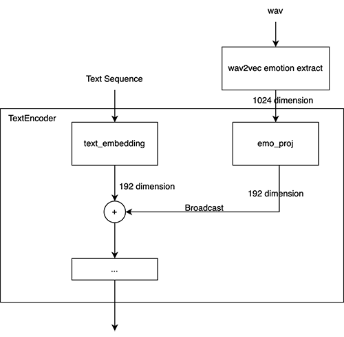

# Emotional VITS

[](https://huggingface.co/spaces/innnky/nene-emotion) 

在线demo ↑↑↑  [bilibili demo](https://www.bilibili.com/video/BV1Vg411h7of)

数据集无需任何情感标注，通过[情感提取模型](https://github.com/audeering/w2v2-how-to) 提取语句情感embedding输入网络，实现情感可控的VITS合成
## 模型结构
+ 相对于原版VITS仅修改了TextEncoder部分


## 模型的优缺点介绍
该模型缺点：
+ 推理时需要指定一个音频作为情感的**参考音频**才能够合成音频，而模型本身**并不知道**“激动”、“平静”这类表示情绪的词语对应的情感特征是什么。
+ 对于只有一个角色的模型，可以通过**预先筛选**的方式，即手动挑选几条“激动”、“平静”、“小声”之类的音频，手动实现情感文本->情感embedding的对应关系 （这个过程可以用[聚类算法](emotion_clustering.ipynb)
简化筛选）
+ 对于有**多个角色**的模型，上述预筛选的方式有**局限性**，因为例如同样对于“平静”这一个情感而言，不同角色对应的情感embedding可能会不同，导致建立情感文本->情感embedding的映射关系很繁琐，很难通过一套统一的标准去描述不同角色之间的相似情感

该模型的优点：
+ **任何**普通的TTS数据集均可以完成情感控制。**无需**手动打情感标签。
+ 由于在训练时候并没有指定情感的文本与embedding的对应关系，所有的情感特征embedding均在一个连续的空间内
+ 因此理论上对于任意角色数据集中出现的情感，推理时均可以通过该模型实现合成，只需要输入目标情感音频对应的embedding即可，而不会受到情感分类数量限制

## 快速挑选各个情感对应的音频
可以使用 **聚类算法** 自动对音频的情感embedding进行分类，大致上可以区分出**情感差异较大**的各个类别，具体使用请参考 [emotion_clustering.ipynb](emotion_clustering.ipynb)

## Pre-requisites
0. Python >= 3.6
0. Clone this repository
0. Install python requirements. Please refer [requirements.txt](requirements.txt)
0. prepare datasets
0. Build Monotonic Alignment Search and run preprocessing if you use your own datasets.
```sh
# Cython-version Monotonoic Alignment Search
cd monotonic_align
python setup.py build_ext --inplace

# Preprocessing (g2p) for your own datasets. Preprocessed phonemes for nene have been already provided.
python preprocess.py --text_index 2 --filelists filelists/train.txt filelists/val.txt


```
5. extract emotional embeddings, this will generate *.emo.npy for each wav file.
```sh
python emotion_extract.py --filelists filelists/train.txt filelists/val.txt
```


## Training Exmaple
```sh

# nene
python train_ms.py -c configs/nene.json -m nene

# if you are fine tuning pretrained original VITS checkpoint ,
python train_ms.py -c configs/nene.json -m nene --ckptD /path/to/D_xxxx.pth --ckptG /path/to/G_xxxx.pth

```


## Inference Example
See [inference.ipynb](inference.ipynb)
